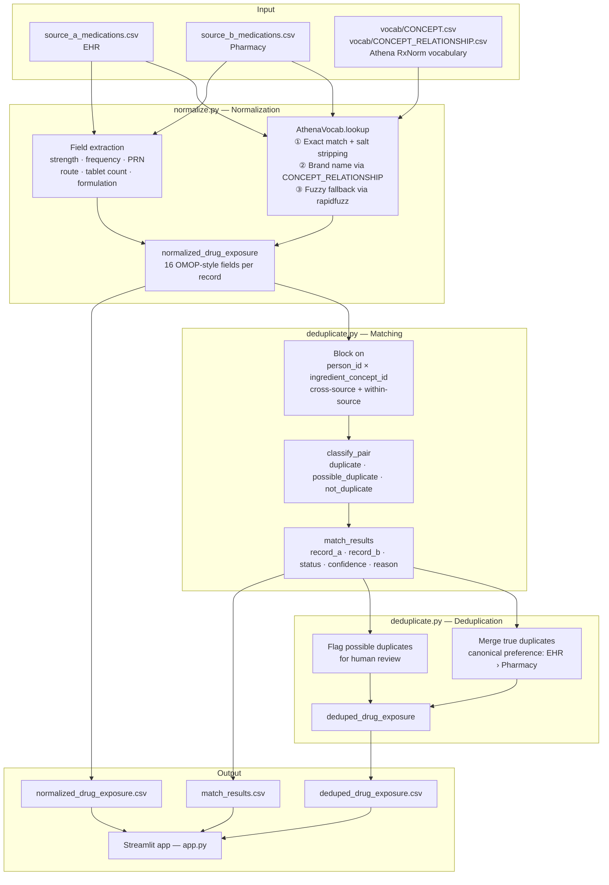
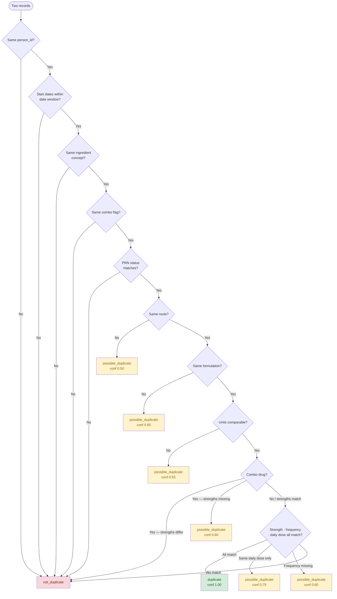

# OMOP-Style Medication Deduplication Demo

## Problem

Two medication datasets may contain overlapping drug exposure records, but the same medication can be represented differently.

Example:

- Metformin 500 mg BID
- metformin 500mg twice daily
- Metformin 0.5 g BID

These strings are different, but they may represent the same medication exposure.

## Goal

Build a small OMOP-style pipeline that:

1. Loads two raw medication datasets.
2. Standardizes both into a simplified `drug_exposure` structure.
3. Maps drug text to real RxNorm concept IDs via the Athena vocabulary (falls back to a mock mapping when vocab files are absent).
4. Normalizes dose, unit, frequency, route, and formulation.
5. Classifies pairs as:
   - duplicate
   - possible_duplicate
   - not_duplicate
6. Creates a final deduplicated output.

## Architecture



## Why OMOP-style?

Instead of comparing raw text directly, both sources are transformed into common OMOP-like fields:

- person_id
- drug_concept_id
- drug_exposure_start_date
- drug_source_value
- route_concept_id
- sig
- drug_type_concept_id

Additional derived fields are used for medication deduplication:

- strength_mg — dose normalized to milligrams (supports mg, g, mcg)
- strength_unit — original unit from source text (mg, g, mcg, units, mEq)
- frequency_per_day — times-per-day derived from sig text
- total_daily_dose_mg — strength × frequency × tablet count
- formulation — IR vs ER
- is_combo_drug — whether the drug is a combination product
- combo_strengths — pipe-delimited sorted strengths for combo drugs (e.g. `50.0|500.0`)

## Assumptions

- `person_id` is already harmonized across both sources.
- This demo focuses on metformin examples.
- Real RxNorm concept IDs are used when `vocab/CONCEPT.csv` is present (downloaded from Athena). A mock keyword mapping is used as a fallback.
- Possible duplicates are not automatically merged.
- Combination drugs are not merged with single-ingredient drugs.

## Normalization Details

### Supported dose units

| Unit | Handling |
|------|----------|
| mg | stored as-is |
| g | converted to mg (× 1000) |
| mcg | converted to mg (÷ 1000) |
| units | not convertible; `strength_mg` is `None` |
| mEq | not convertible; `strength_mg` is `None` |

### Supported frequency expressions

Standard abbreviations: `BID`, `TID`, `QID`, `QD`, `QHS`, `QAM`, `QPM`, `QOD`

Interval notation: `q4h`, `q6h`, `q8h`, `q12h`

Plain English: `once daily`, `twice daily`, `three times daily`, `four times daily`, `every 4/6/8/12 hours`, `every other day`, `weekly`, `twice weekly`, `monthly`

Frequency is always resolved to a **times-per-day** float. Unrecognized expressions (e.g. `prn`) return `None`.

### Supported routes

Oral, intravenous (IV), topical, inhalation, subcutaneous (SQ/SC), sublingual (SL), transdermal, rectal (PR), intramuscular (IM), nasal, ophthalmic, otic.

### Tablet/capsule multiplier

Extracts per-dose count from phrases like:

- `take 2 tablets daily` → 2
- `two tablets daily` → 2
- `take ½ tablet` / `take 1/2 tablet` → 0.5

## Matching Rules

Comparisons are run in two passes:
- **Cross-source** — every unique unordered pair of source systems (EHR vs Pharmacy, EHR vs Claims, etc.)
- **Within-source** — records within the same source system, to catch data-entry duplicates (same drug entered twice in the EHR on the same day)

### Decision Logic



### Duplicate

All of the following must match (within tolerance):

- person_id
- ingredient concept
- PRN status (both scheduled, or both PRN)
- formulation
- route
- start date within the allowed window (default: 7 days)
- strength (within 1% relative tolerance)
- frequency
- total daily dose (within 1% relative tolerance)

Dose comparisons use a **relative tolerance** (default 1%) rather than exact equality, so minor floating-point differences and unit-notation variants (e.g. `0.5 g` vs `500 mg`) are handled correctly.

### Possible Duplicate

Same patient and ingredient, but one of the following is missing or conflicting:

- route
- formulation
- strength units are not comparable (e.g. mg vs units)
- frequency missing in one record
- same total daily dose but different per-tablet strength or frequency
- combo drug strengths missing in one record

### Not Duplicate

Any of the following:

- different patient
- different ingredient concept
- combination drug vs single-ingredient drug
- scheduled vs PRN regimen
- different combo drug strength profile
- start date outside the allowed window
- different dose or frequency (after tolerance check)

## Configurable Parameters

`generate_match_results` and `build_deduped_drug_exposure` accept optional parameters:

| Parameter | Default | Description |
|-----------|---------|-------------|
| `date_window_days` | `7` | Maximum days between start dates to be considered a duplicate |
| `dose_tolerance` | `0.01` | Relative tolerance for numerical dose comparisons (1%) |
| `canonical_preference` | source order | Ordered list of source systems; the first match becomes the canonical record |

Example:

```python
match_results = generate_match_results(normalized, date_window_days=14, dose_tolerance=0.05)
deduped = build_deduped_drug_exposure(normalized, match_results, canonical_preference=["EHR", "Pharmacy"])
```

## Performance

The pipeline is optimised for correctness at demo scale, with several decisions that keep it efficient as data grows:

| Concern | Approach |
|---------|----------|
| Matching complexity | Records are grouped by `(person_id, ingredient_concept_id)` before comparison, so only same-patient, same-drug pairs are ever evaluated. For *p* patients with *n* records each across *d* distinct drugs, this reduces comparisons from O(*n*²/*p*) to O(*n*²/(*p*·*d*)). |
| Concept mapping sort | The mapping DataFrame is sorted by keyword length once at load time (`_prepare_mapping`) rather than on every row. |
| Frequency phrase sort | `_FREQUENCY_PHRASES` is pre-sorted at module load so `extract_frequency` iterates a fixed list on every call. |
| Row iteration | Normalization uses `DataFrame.apply()` and deduplication uses `to_dict("records")` instead of `iterrows()`, avoiding per-row Series creation overhead. |
| Unmapped records | Records with no matched ingredient concept are excluded from the blocking index and never compared — there is no basis for identifying them as duplicates. |

For datasets beyond ~100k records per source, the remaining bottleneck is the pairwise inner loop per (patient, ingredient) block. The next step would be adding a date bucket to the blocking key to further limit comparisons within each block.

## Multi-Source Support

The pipeline supports any number of source systems. Every unique pair of source systems is compared — not just EHR vs Pharmacy. Adding a third source (e.g. Claims) automatically generates comparisons for all three pairs.

## Outputs

Generated files:

- `outputs/normalized_drug_exposure.csv`
- `outputs/match_results.csv`
- `outputs/deduped_drug_exposure.csv`

## Real OMOP Vocabulary (Athena)

The pipeline can use real RxNorm concept IDs from an [Athena](https://athena.ohdsi.org) vocabulary download instead of the mock mapping CSV.

**Setup:**
1. Download the RxNorm (and optionally NDC) vocabulary from Athena.
2. Place `CONCEPT.csv` in a `vocab/` directory at the project root.

The pipeline auto-detects `vocab/CONCEPT.csv` at startup — no extra flags needed:

```bash
python src/main.py
# INFO: Auto-detected Athena vocabulary at vocab/CONCEPT.csv
# INFO: Loaded 14610 RxNorm ingredient concepts
```

To use a different path explicitly:

```bash
python src/main.py --vocab /path/to/CONCEPT.csv
```

To force the legacy mock mapping (e.g. in CI without the vocabulary file):

```bash
python src/main.py --mapping data/mock_concept_mapping.csv
```

### How Athena lookup works

`src/vocab.py` implements `AthenaVocab`, which maps raw drug text to RxNorm concept IDs through three matching stages in order:

**Stage 1 — Exact ingredient match**
- Loads only the ~14K RxNorm Ingredient concepts from the 1.8M-row CONCEPT.csv.
- Strips 30 common salt and form qualifiers (`hydrochloride`, `sodium`, `phosphate`, `hcl`, etc.) from the drug text before matching, so `metformin hydrochloride 500 mg` correctly resolves to the `metformin` concept.
- Sorts by name length descending so the longest matching ingredient wins.
- Uses word-boundary checking to prevent short ingredient names (e.g. `gold`, `zinc`) from matching inside unrelated words.

**Stage 2 — Brand name lookup**
- Loads 11,804 brand→ingredient links from `CONCEPT_RELATIONSHIP.csv` using the `Brand name of` relationship (requires the file to be present in `vocab/`).
- Maps trade names directly to their ingredient concept: `Glucophage` → metformin (1503297), `Lipitor` → atorvastatin (1545958).

**Stage 3 — Fuzzy fallback**
- Uses `rapidfuzz` token-sort ratio against the first token of the drug text.
- Catches common misspellings (e.g. `metfromin` → metformin) with a minimum similarity threshold of 88/100.
- Only triggered when stages 1 and 2 both fail.

Combo drugs are detected by a slash in the drug name (`metformin/sitagliptin`); each half is resolved independently through the same three stages.

The `drug_concept_id` and `ingredient_concept_id` fields returned are real RxNorm concept IDs (e.g. metformin = 1503297, sitagliptin = 1580747).

## How to Run the Pipeline

Create and activate a virtual environment:

```bash
python3 -m venv venv
source venv/bin/activate
```

Install dependencies:

```bash
pip install -r requirements.txt
```

Run the deduplication pipeline:

```bash
python src/main.py
```

The pipeline logs progress at each stage:

```
2024-01-10 12:00:00 INFO __main__: Starting OMOP medication deduplication pipeline
2024-01-10 12:00:00 INFO __main__: Auto-detected Athena vocabulary at vocab/CONCEPT.csv
2024-01-10 12:00:00 INFO __main__: Brand name lookup enabled via vocab/CONCEPT_RELATIONSHIP.csv
2024-01-10 12:00:00 INFO vocab: Loaded 14610 RxNorm ingredient concepts
2024-01-10 12:00:00 INFO vocab: Loaded 11804 brand name → ingredient mappings
2024-01-10 12:00:00 INFO __main__: Normalized 16 records
2024-01-10 12:00:00 INFO __main__: Generated 7 match pairs
2024-01-10 12:00:00 INFO __main__: Deduplicated to 14 canonical records
```

## Running Tests

```bash
pytest tests/ -v
```

146 tests cover:

- Unit tests for all parsing functions (strength, frequency, route, tablet multiplier, combo strengths, concept mapping)
- Unit tests for deduplication logic (dose tolerance, all match classifications, N-source matching, canonical preference)
- Integration tests asserting on known pipeline outcomes from the mock data
- Integration tests for the Athena vocabulary path (skipped automatically when `vocab/CONCEPT.csv` is absent)
- Unit tests for all three AthenaVocab matching stages (exact, brand name, fuzzy)
- Unit tests for the ingredient-level blocking in `generate_match_results`

## Optional Streamlit App

This project also includes a lightweight Streamlit app for visually inspecting the pipeline outputs.

The app helps review:

- Normalized OMOP-style drug exposure records
- Pairwise deduplication match results
- Final deduplicated drug exposure table

### Run the Streamlit App

After installing the dependencies, start the app with:

```bash
streamlit run app.py
```

Then open the local URL shown in the terminal, usually:

```text
http://localhost:8501
```

## Project Structure

```text
omop-med-dedup/
├── app.py
├── requirements.txt
├── README.md
├── data/
│   ├── source_a_medications.csv
│   ├── source_b_medications.csv
│   └── mock_concept_mapping.csv
├── vocab/                          # optional — Athena vocabulary download
│   └── CONCEPT.csv                 # auto-detected at startup
├── outputs/
│   ├── normalized_drug_exposure.csv
│   ├── match_results.csv
│   └── deduped_drug_exposure.csv
├── src/
│   ├── main.py
│   ├── vocab.py                    # Athena RxNorm concept lookup
│   ├── normalize.py
│   └── deduplicate.py
└── tests/
    ├── test_normalize.py
    ├── test_deduplicate.py
    └── test_pipeline.py
```

## Notes

This project started as a simplified demo and has been extended to support real Athena/OMOP vocabulary. It uses official OMOP RxNorm concept IDs when `vocab/CONCEPT.csv` is present, and falls back to a mock keyword mapping otherwise.

The goal is to demonstrate how medication text from multiple sources can be standardized into common fields before applying rule-based deduplication logic.

Notable scope limitations that remain out of range for this demo:

- **Patient identity resolution** — `person_id` is assumed pre-harmonized across sources; cross-system patient matching is a separate problem.
- **Possible duplicate resolution** — flagged records are held for human review; no automated merge or feedback loop is included.
- **Database backend** — the pipeline reads and writes CSV files; a production system would operate against a PostgreSQL or Snowflake OMOP CDM schema.
- **Date-bucket blocking** — comparisons are blocked on `(person_id, ingredient_concept_id)`; adding a date bucket to the key would further reduce the inner loop for patients with many records of the same drug.
- **Days supply / quantity** — two dispensings of the same drug at different quantities (30-day vs 90-day fill) may be refills rather than duplicates; the pipeline does not yet distinguish between them.
- **Dose form** — tablet vs capsule vs oral solution is not currently captured; only ER vs IR formulation is compared.
